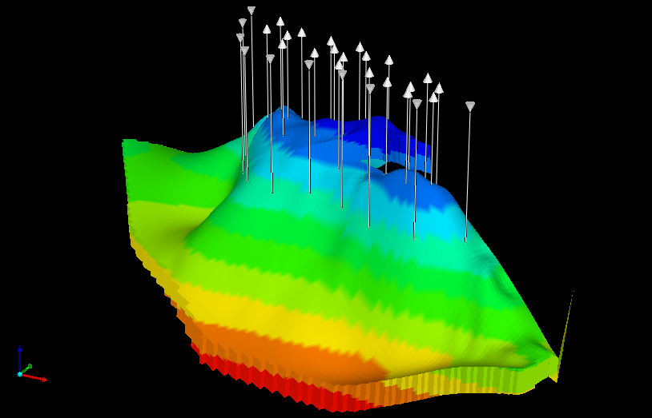

Brugge Field
============

This case study consists of the benchmark Brugge field case developed and
made available by [TNO](https://www.tno.nl) for academic purposes. For a
better description, please read my Master's dissertation.



Dependencies
------------

* [CMG software](http://www.cmgl.ca/software) (IMEX and Results Report)

Instructions
------------

CMG software is closed-source. Make sure you have a license that allows
multiple reservoir simulations to be run in parallel.

Run the study with, for instance:

```
mpirun -np 100 python main.py
```

and check the results:

```
python results.py
```
