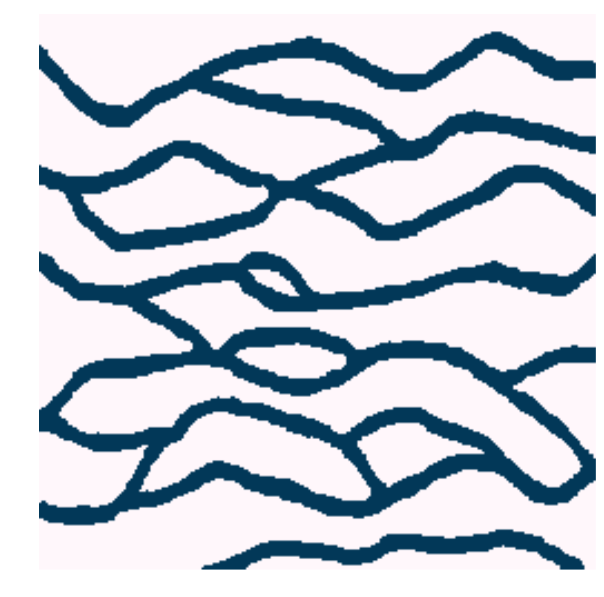

Channelized Reservoir
=====================

This case study consists of a blackoil flow model on top of a synthetic
channelized training image extensively used at Stanford University. For
a better description, please read my Master's dissertation.



Dependencies
------------

* [opm-core](https://github.com/OPM/opm-core)
* [SuiteSparse](http://www.cise.ufl.edu/research/sparse/SuiteSparse)
* [Boost C++ Libraries](http://www.boost.org)
* [Modified SGeMS](https://github.com/juliohm/ar2tech-SGeMS-public) (for Filtersim-based proposal)

Instructions
------------

All dependencies (except [SGeMS](https://github.com/juliohm/ar2tech-SGeMS-public))
are necessary to build the OPM-based blackoil simulator developed for this case study.
After all of them were correctly installed, run `make` to build the simulator:

```
make
```

If the build is successful, run the study with, for instance:

```
mpirun -np 100 python main.py
```
